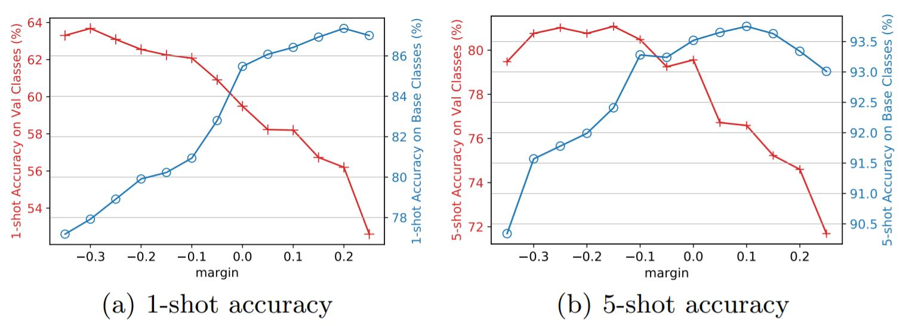

# Neg-Margin Matters: Understanding Margin in Few-shot Classification

By [Bin Liu](https://scholar.google.com/citations?user=-RYlJvYAAAAJ&hl=zh-CN), [Yue Cao](http://yue-cao.me), Yutong Lin, Qi Li, [Zheng Zhang](https://www.microsoft.com/en-us/research/people/zhez/), [Mingsheng Long](http://ise.thss.tsinghua.edu.cn/~mlong/), [Han Hu](https://ancientmooner.github.io/).

This repo is an official implementation of [Negative Margin Matters: Understanding Margin in Few-shot Classification](https://arxiv.org/abs/2003.12060) on PyTorch.

## Citation
```
@Article{liu2020negative,
  title={Negative Margin Matters: Understanding Margin in Few-shot Classification},
  author={Bin Liu and Yue Cao and Yutong Lin and Qi Li and Zheng Zhang and Mingsheng Long and Han Hu},
  journal={arXiv preprint arXiv:2003.12060},
  year={2020}
}
```

## Highlight



We introduce a `negative` margin [cosine] softmax crossentropy loss to metric learning-based few-shot learning methods.

As shown in the figure above, applying larger margin to softmax loss can achieve better accuracy on base classes. But surprisingly, applying appropriate negative margin to softmax loss can achieve
state-of-the-art few-shot accuracy on novel classes.

## Environment
 - `Anaconda` with `python >= 3.6`
 - `pytorch=1.2.0, torchvison, cuda=9.2`
 - others: `pip install yacs`

## Getting started
### CUB
* Change directory to `./data/CUB`
* run `bash ./download_CUB.sh`

### mini-ImageNet
* Change directory to `./data/miniImagenet`
* run `bash ./download_miniImagenet.sh` 

(WARNING: This would download the 155G ImageNet dataset. You can comment out correponded line 5-6 in `download_miniImagenet.sh` if you already have one.) 

### mini-ImageNet->CUB
* Finish preparation for CUB and mini-ImageNet and you are done!

## Train and eval
Run the following commands to train and evaluate:

```
python main.py --config [CONFIGFILENAME] \
    --supp [SUPPLEMENTSTRING] \
    method.backbone [BACKBONE] \
    method.image_size [IMAGESIZE] \
    method.metric_params.margin [MARGIN] \
    [OPTIONARG]
```

 For additional options, please refer to `./lib/config.py`.

## Pre-train weights

We have provided the train scripts to reproduce the results of `resnet18`. Pleas check `./script` for details.

Also, you can download the pre-trian model checkpoints of `resnet18` from [OneDrive](https://1drv.ms/u/s!AsaPPmtCAq08pRM54_CuGPFbfgUz?e=ydjBfW)

## References
Our testbed builds upon several existing publicly available code. Specifically, we have modified and integrated the following code into this project:

* Framework, Backbone, Method: Closer Look at Few Shot
https://github.com/wyharveychen/CloserLookFewShot
* Backbone(resnet12): MetaOpt
https://github.com/kjunelee/MetaOptNet
* Backbone(WideResNet28_10): S2M2_R
https://github.com/nupurkmr9/S2M2_fewshot
